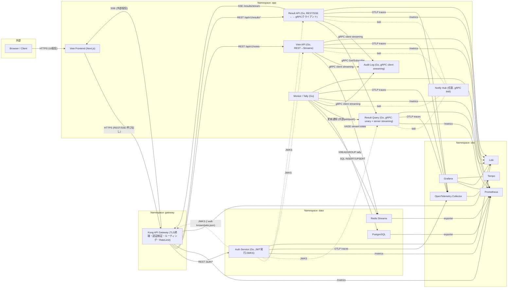

# k8s-vote-platform

```mermaid
flowchart LR
  %% ===== Groups =====
  subgraph ext[外部]
    user["Browser / Client"]
  end

  subgraph ns_gateway[Namespace: gateway]
    gw["Kong API Gateway (TLS終端・認証検証・ルーティング・RateLimit)"]
  end

  subgraph ns_app[Namespace: app]
    fe["Vote Frontend (Next.js)"]
    voteapi["Vote API (Go, REST→Streams)"]
    resultapi["Result API (Go, REST/SSE ←→ gRPCクライアント)"]
    rq["Result Query (Go, gRPC: unary + server streaming)"]
    worker["Worker / Tally (Go)"]
    audit["Audit Log (Go, gRPC client streaming)"]
    notify["Notify Hub (任意, gRPC bidi)"]
  end

  subgraph ns_data[Namespace: data]
    auth["Auth Service (Go, JWT発行/JWKS)"]
    redis["Redis Streams"]
    db["PostgreSQL"]
  end

  subgraph ns_obs[Namespace: obs]
    prom["Prometheus"]
    graf["Grafana"]
    loki["Loki"]
    tempo["Tempo"]
    otel["OpenTelemetry Collector"]
  end

  %% ===== External path =====
  user -->|"HTTPS (UI配信)"| fe
  fe -->|"HTTPS (REST/SSE 呼び出し)"| gw

  %% ===== Gateway routing =====
  gw -->|"REST /auth/*"| auth
  gw -->|"REST /api/v1/votes"| voteapi
  gw -->|"REST /api/v1/results*"| resultapi

  %% ===== Async queue path =====
  voteapi -->|"XADD stream:votes"| redis
  worker -->|"XREADGROUP tally"| redis
  worker -->|"SQL INSERT/UPSERT"| db

  %% ===== Result query & streaming =====
  worker -->|"更新通知 (内部pub/push)"| rq
  resultapi -->|"gRPC Get/Subscribe"| rq
  resultapi -->|"SSE /results/stream"| gw
  gw -->|"SSE (外部配信)"| fe

  %% ===== Audit log (client streaming) =====
  voteapi -->|"gRPC client streaming"| audit
  worker  -->|"gRPC client streaming"| audit
  resultapi -->|"gRPC client streaming"| audit

  %% ===== Notify Hub (optional) =====
  voteapi -. "bidi" .- notify
  worker  -. "bidi" .- notify
  rq      -. "bidi" .- notify
  resultapi -. "bidi" .- notify

  %% ===== JWKS distribution =====
  auth -.->|"JWKS (/.well-known/jwks.json)"| gw
  auth -.->|"JWKS"| voteapi
  auth -.->|"JWKS"| resultapi
  auth -.->|"JWKS"| rq

  %% ===== Observability =====
  gw -->|"/metrics"| prom
  voteapi -->|"/metrics"| prom
  resultapi -->|"/metrics"| prom
  rq -->|"/metrics"| prom
  worker -->|"/metrics"| prom
  auth -->|"/metrics"| prom
  redis -->|"exporter"| prom
  db -->|"exporter"| prom

  voteapi -->|"OTLP traces"| otel
  resultapi -->|"OTLP traces"| otel
  rq -->|"OTLP traces"| otel
  worker -->|"OTLP traces"| otel
  auth -->|"OTLP traces"| otel
  otel --> tempo

  gw --> loki
  voteapi --> loki
  resultapi --> loki
  rq --> loki
  worker --> loki
  auth --> loki

  graf --- prom
  graf --- loki
  graf --- tempo

```
### 起動方法
プロジェクト直下にて
```bash
make start
```